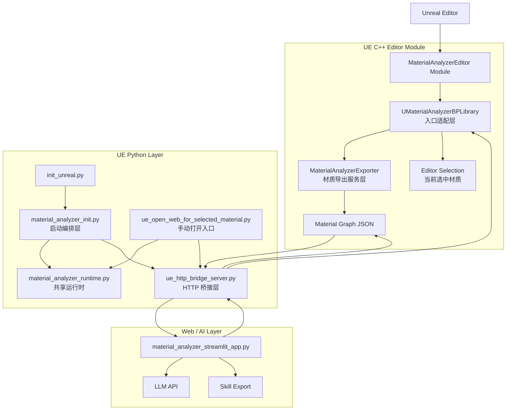

# MaterialAnalyzer 插件架构说明

本文档描述当前已经落地的拆分，以及建议继续保持的插件分层方式。

## 1. 设计目标

这个插件不应该继续演化成“一个模块里什么都做”。更合理的目标是：

1. UE C++ 只负责和编辑器、材质资源打交道。
2. Python 桥接层只负责把 UE 能力暴露给外部工具。
3. Web / AI 层只负责展示、分析和导出结果。
4. 每一层都尽量通过稳定的数据结构通信，而不是互相直接依赖内部实现细节。

## 2. 当前推荐分层

### 2.1 C++ Editor 模块

职责：

1. 提供 UE 编辑器里的入口能力。
2. 从材质对象提取节点、连线、属性、注释。
3. 输出稳定 JSON。

建议内部继续分成两层：

1. 入口适配层
   - `UMaterialAnalyzerBPLibrary`
   - 只负责“按路径调用”和“按当前选中调用”

2. 导出服务层
   - `MaterialAnalyzerExporter`
   - 只负责构建材质摘要 JSON

后续还可以再加：

1. `MaterialAnalyzerSelectionService`
   - 只负责从 `GEditor` / `USelection` 里解析当前材质

2. `MaterialAnalyzerSchema`
   - 统一管理 JSON 字段常量，避免跨语言字段名漂移

### 2.2 Python 运行时层

职责：

1. 检查 `.venv` 是否存在。
2. 检查 `streamlit`、`requests`、`pandas` 等依赖。
3. 启动本地 Streamlit 服务。
4. 处理打开浏览器这类通用动作。

当前已经抽成：

1. `material_analyzer_runtime.py`
   - 共享运行时工具
   - 被多个 Python 入口复用

### 2.3 Python 编排层

职责：

1. 决定“什么时候拉起桥接服务”。
2. 决定“什么时候打开 Web 页面”。
3. 不直接实现底层启动细节。

当前包括：

1. `material_analyzer_init.py`
   - 插件启动入口编排

2. `ue_open_web_for_selected_material.py`
   - 手动打开页面的显式入口

### 2.4 Python 桥接层

职责：

1. 在 UE Python 环境中启动 HTTP 服务。
2. 把 UE C++ 蓝图库结果暴露成 HTTP API。
3. 必要时做兼容降级和 fallback。

当前文件：

1. `ue_http_bridge_server.py`

建议后续约束：

1. 尽量只保留固定端点。
2. 不继续扩大 `/run_python` 这类通用执行口的使用范围。

### 2.5 Web / AI 应用层

职责：

1. 调桥接接口获取结构化材质图。
2. 展示节点、连线、属性信息。
3. 调用大模型分析。
4. 导出 Skill 规则脚本。

当前文件：

1. `material_analyzer_streamlit_app.py`

建议原则：

1. 这里可以快迭代。
2. 但不要把 UE 内部逻辑反向写死到前端里。

## 3. 当前已经完成的拆分

本次重构已经完成：

1. C++ 中把材质导出和 JSON 组装逻辑从 `UMaterialAnalyzerBPLibrary` 抽到 `MaterialAnalyzerExporter`。
2. Python 中把 venv 检查、依赖检查、启动 Streamlit、打开 URL 等公共能力抽到 `material_analyzer_runtime.py`。
3. `material_analyzer_init.py` 和 `ue_open_web_for_selected_material.py` 现在都变成了更薄的编排层。

## 4. 推荐目录职责图

```text
MaterialAnalyzer/
├─ MaterialAnalyzer.uplugin               插件声明
├─ ARCHITECTURE.md                        架构文档
├─ Source/
│  └─ MaterialAnalyzerEditor/
│     ├─ Public/
│     │  └─ MaterialAnalyzerBPLibrary.h   蓝图/UE Python 可调用入口
│     └─ Private/
│        ├─ MaterialAnalyzerEditorModule.cpp   模块启动
│        ├─ MaterialAnalyzerBPLibrary.cpp      入口适配层
│        └─ MaterialAnalyzerExporter.cpp       材质导出服务层
├─ Content/
│  └─ Python/
│     ├─ init_unreal.py                        Python 启动代理
│     ├─ material_analyzer_init.py             启动编排层
│     ├─ material_analyzer_runtime.py          共享运行时层
│     ├─ ue_http_bridge_server.py              HTTP 桥接层
│     ├─ ue_open_web_for_selected_material.py  手动入口
│     └─ material_analyzer_streamlit_app.py    Web/AI 应用层
└─ Skills/
   └─ *.py                               导出的规则模块
```

## 5. 完整架构图



## 6. 初学者开发插件时的判断原则

当你准备往插件里加一个新功能时，先问自己 3 个问题：

1. 这个功能是在“取数据”，还是在“展示数据”？
2. 这个功能必须依赖 Unreal Editor 吗？
3. 这个功能是插件核心能力，还是上层工作流能力？

如果答案是：

1. “取数据”
   - 放到 C++ 服务层或桥接层附近。

2. “展示数据 / 调 AI / 导出报告”
   - 放到 Web / 应用层。

3. “只是启动、打开、检查环境”
   - 放到 Python 编排层或运行时层。

## 7. 下一步建议

如果继续往下拆，推荐顺序是：

1. 新建 `MaterialAnalyzerSelectionService`，把 `GEditor` 相关逻辑从蓝图库里继续抽出去。
2. 给 C++ 和 Python 之间的 JSON 建一个固定 schema 常量层。
3. 收紧桥接层的通用执行入口，减少未来继续耦合的风险。
4. 如果插件后续有按钮、菜单、面板，再单独加 UI 层，不要塞回 BPLibrary。